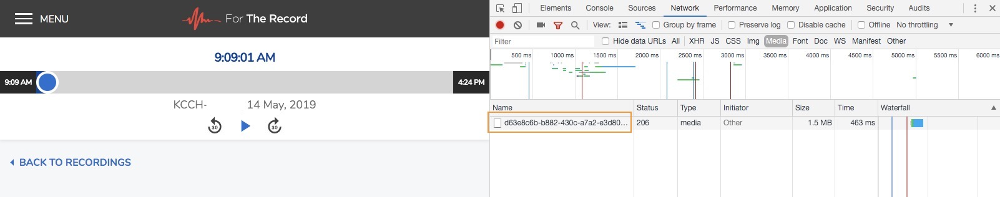
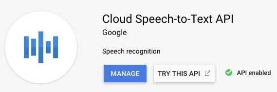
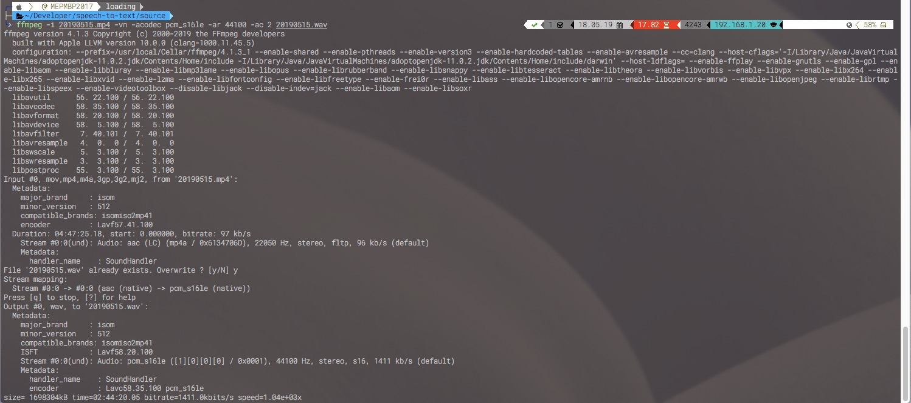

# **Convert Court proceedings recordings to Text Transcripts**

**How to deal with annoying .trm files to useful, searchable text.**

Court proceedings are usually offered in FTR ([For The Record](https://www.fortherecord.com/)) format or WAV. WAV is not only more expensive (because it requires 74 mins for each hour on every CD-ROM) but not useful for Court reporters, if that is the eventual path for the materials. Courts usually make available the FTR files within the hour of the order. FTR is a proprietary format, with virtually no other playback or export option online. The purpose of the proprietary format is to enable pedals and Court Clerk control for the transcription process.  This set of scripts and Python tools are meant to minimize the suckage related to getting these FTRs from the Court and actually manipulating them.

**For The Record Online Account to Upload Files for the Player**

Create an online account with FTR Online player where you can upload your content from the Court.  This is nice so you don't have to worry about having your files on your local system wasting space. Open your .TRM file in the FTR Online Player. 

**How to Use Chrome (Developer inspection) to Extract MP4**

Open "Developer" with F12 (in Chrome, other browsers have similar options) under View and go to the "Network" tab.  Find the sub-tab "Media", by selecting "play" in the browser, you will see the media that's being played. Right-click on the GUID-ish looking media file and open in new tab or download as MP4.  See the below image with the GUID-ish highlighted in orange. When you see the same number multiple times, rest assured its the same file, just presented multiple times during the sessions it is playing. 

Once you download all of the MP4 files and name them appropriately, I use the date 20190514.mp4 and so on. Proceed to Google Platform setup and download your **api-key.json**, you'll need this for running the scripts in the later sections. 

**Setting Up Your Google Platform Account**

Create an free tier account which I think gives about $300 of API/compuation. Fifteen seconds of Google Transcript is between .006 to .009 depending on the level of debugging information configured. 

[Google Cloud Platform Free](https://cloud.google.com/free/) An account is required to get an **api-key.json** file.

1. Sign-in to Google Cloud Console
2. Click “API Manager”
3. Click “Credentials”
4. Click “Create Credentials”
5. Select “Service Account Key”
6. Under “Service Account” select “New service account”
7. Name service (whatever you’d like)
8. Select Role: “Project” -> “Owner”
9. Leave “JSON” option selected
10. Click “Create”
11. Save generated API key file
12. **Rename file to api-key.json**

**Clone this repo** 

`git clone https://github.com/markedphillips/speech-to-text-batch`

**Install prerequisites**

The following are libraries for dealing with media formats, audio silence, support for the Python Google libraries, and the working folders.

`brew install ffmpeg sox`

`pip install -r requirements.txt`

`mkdir working_source parts day hours thirty`

`source ./process_file.sh` for good measure to bring into scope the helper functions.

**Walking through processing audio files from .TRM to .WAV**

As described above using Chrome and the FTR Online Player, you'll convert .TRM file to .MP4, saving you *Jesus-amounts-of-time*. Air hi-give to [u/xelalex42](https://www.reddit.com/user/xelalex42/).  

**Converting .MP4 to .WAV using ffmpeg is cake**

`ffmpeg -i input.mp4 -vn -acodec pcm_s16le -ar 44100 -ac 2 output.wav`

From here, placing your .WAV files in the source/ directory will stage it for batch transcription. The following will pull all the jobs in source/ and process the audio (slice and silence extraction), transcribe the text, combine the transcription with the following: 

`./batch.sh`

**The following detail the internals of this process.**

Helper functions for this section are located in
`source ./process_file.sh` including converting audio formats and slicing audio times.  Depending on your audio times, transcription needs, you may want to do a pass by hand.

**Sub-division of Long Audio into Day/Hour/Thirty-minute Parts**

Google Cloud Speech API doesn't like files longer than 60 seconds, so the functions included in process_files.sh slice up the source files in a variety of subsections by day, hour and 30 minute parts. The function requires passing a filename already stored in source/ and the sliced files are placed in the corresponding day/, hour/ or thirty/ folder. The idea is to subdivide the transcription as not f**k up the transcription work. 

**Removing Long Silences**

Processing large volumes of audio from sources such as Court, there is bound to be large blocks of silence and other sounds which may hose your transcription. When processing 10 hours of audio, it would get to the 7th hour and puke because of the transcript returning nothing. 

`remove_silence FILENAME.wav` will drastically save you file size and Google transcription errors.

**Sub-dividing N-hours to Google Transcription API parts.**

Convert .WAV source into sub-minute parts for processing

`ffmpeg -i $1 -f segment -segment_time 59 -c copy parts/out%09d.wav`

As the Google API charges .006 per API call, using 30-second samples adds up. Being on the safe side we create 59-second samples.

When files are ready to be processed in the parts/ folder, calling:

`python3 slow.py` or 
`python3 fast.py`

Slow.py does not employ threading while fast.py does. If you have any meaningful amounts of transcription work, you'll want to use fast.py. Both direct calls output 'transcript.txt', the batch.sh script is the one which date-time stamps the transcripts and combines them at the end. 

The batch.sh and slow.py and fast.py will require authentication of the Google Speech API against your **api-key.json** and begin to build your transcript.txt As discussed above, you may care about the specific sizing of the transcript.

In testing I was able to take 10 hours of court transcripts processed in under twenty (20) minutes with eight (8) threads. Ten (10) hours is about 1,121 API calls at .006 or $6.70, this was using thirty (30) second parts. Obviously, that means half that amount. Batch.sh by default uses the most cost effective call and pulls from source/ regardless of audio length.

**TODO**
1. Make better timestamps
2. Separate speakers

Scripts were derived from the work of [Alex](https://www.alexkras.com/). I added infrastructure to drop in the MP4 files into the source folder and generate transcript breaking apart the file and combining them back together.
